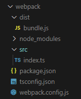

#### 最基本的webpack 配置



tsconfig.json 配置

```json
{
    // "include": [
    //     "./src/**/*"
    // ],
/* "exclude": [
        
    ], */
    "compilerOptions": {
        "target": "es6",
        "module": "es6",
        "strict": true,
        // "outDir": "./dist"
    }
}
```

package.json 配置

```
{
  "name": "webpack",
  "version": "1.0.0",
  "main": "index.js",
  "scripts": {
    "test": "echo \"Error: no test specified\" && exit 1",
    "build": "webpack"
  },
  "keywords": [],
  "author": "",
  "license": "ISC",
  "description": "",
  "devDependencies": {
    "ts-loader": "^9.3.0",
    "typescript": "^4.6.4",
    "webpack": "^5.72.0",
    "webpack-cli": "^4.9.2"
  }
}
```

webpack.config.js 配置

```
// 引入一个包(nodejs中一个模块，主要作用时拼接路径)
const path = require('path');

// webpack 中所有的配置信息都应该写在 module.exports 中
module.exports = {
    // 指定入口文件
    entry: "./src/index.ts",

    // 指定打包文件所在目录
    output: {
        // 指定打包文件目录
        path: path.resolve(__dirname, 'dist'),
        // 打包后文件的名字
        filename: "bundle.js"
    },

    // 指定webpack打包时要使用的模块
    module: {
        // 指定要加载的规则
        rules: [
            {
                // test指定的时规则生效的文件
                test: /\.ts$/,
                // 要使用的loader
                use: 'ts-loader',
                // 指定要排除的文件
                exclude: /node-modules/
            }
        ]
    },
    mode: "development"
}
```

#### 安装插件后的配置

package.json

```json
{
  "name": "webpack",
  "version": "1.0.0",
  "main": "index.js",
  "scripts": {
    "test": "echo \"Error: no test specified\" && exit 1",
    "build": "webpack",
    "start": "webpack serve --open --mode production"
  },
  "keywords": [],
  "author": "",
  "license": "ISC",
  "description": "",
  "devDependencies": {
    "@babel/core": "^7.17.10",
    "@babel/preset-env": "^7.17.10",
    "babel-loader": "^8.2.5",
    "clean-webpack-plugin": "^4.0.0",
    "core-js": "^3.22.4",
    "html-webpack-plugin": "^5.5.0",
    "ts-loader": "^9.3.0",
    "typescript": "^4.6.4",
    "webpack": "^5.72.0",
    "webpack-cli": "^4.9.2",
    "webpack-dev-server": "^4.9.0"
  }
}
```

webpack.config.js

```javascript
// 引入一个包(nodejs中一个模块，主要作用时拼接路径)
const path = require('path');
// 引入 html 插件
const HTMLWebpackPlugin = require('html-webpack-plugin');
// 引入 clean 插件
const {
    cleanWebpackPlugin
} = require('clean-webpack-plugin');

// webpack 中所有的配置信息都应该写在 module.exports 中
module.exports = {
    // 指定入口文件
    entry: "./src/index.ts",

    // 指定打包文件所在目录
    output: {
        // 指定打包文件目录
        path: path.resolve(__dirname, 'dist'),
        // 打包后文件的名字
        filename: "bundle.js",
        // 在build前清空dist目录所有文件，避免旧文件的遗留
        clean: true
    },

    // 指定webpack打包时要使用的模块
    module: {
        // 指定要loader加载的规则
        rules: [{
            // test指定的是规则生效的文件
            test: /\.ts$/, //以ts结尾的文件
            // 要使用的loader
            use: [
                // 配置babel
                {
                    //指定加载器
                    loader: "babel-loader",
                    // 设置babel
                    options: {
                        //设置预定义的环境
                        presets: [
                            [
                                //指定环境的插件
                                "@babel/preset-env",
                                // 配置信息
                                {
                                    // 要兼容的目标浏览器及版本
                                    targets: {
                                        "chrome": "58",
                                        "ie": "11"
                                    },
                                    //指定corejs的版本（根据package.json中的版本，只写整数）
                                    "corejs": "3",
                                    //使用corejs的方式 "usage"  表示按需加载
                                    "useBuiltIns": "usage"
                                }

                            ]
                        ]
                    }
                },
                // 'babel-loader',
                'ts-loader'
            ],
            // 要排除的文件
            exclude: /node-modules/
        }]
    },
    mode: "development",
    // 配置 webpack 插件
    plugins: [
        new HTMLWebpackPlugin({
            // title: "出岫构建",
            // 设置 html 模版（在src文件夹下新建 index.html文件，并设置模版样式）
            template: "./src/index.html"
        }),
    ]
}
```

tsconfig.json

```json
{
    "include": [
        "./src/**/*"
    ],
    "exclude": [

    ],
    "compilerOptions": {
        "target": "es6",
        "module": "es6",
        "strict": true,
        "outDir": "./dist"
    }
}
```

